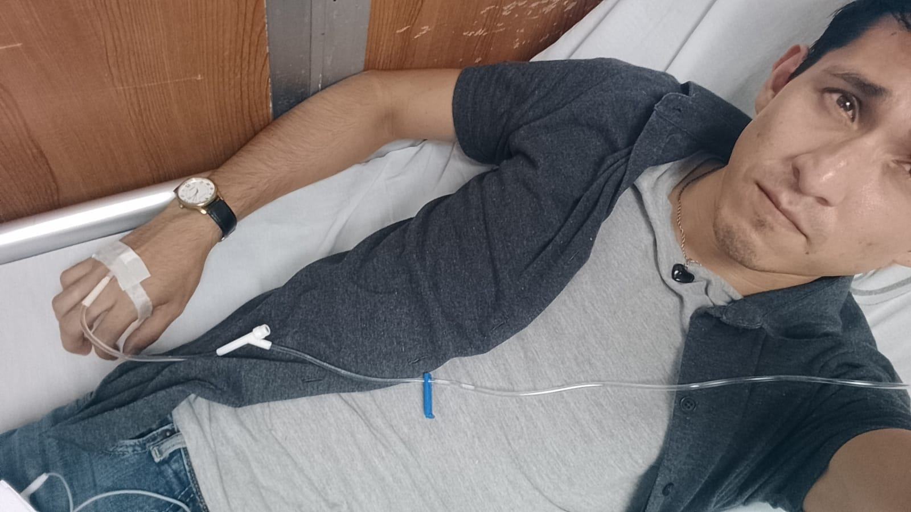

<!DOCTYPE html>
<html lang="es">
<head>
    <meta charset="UTF-8">
    <meta name="viewport" content="width=device-width, initial-scale=1.0">
    <title>¡Feliz Cumpleaños Diego🎉!</title>
    
    
    
</head>
<body>
    

    
    

        <h1>Feliz Cumpleaños Diego</h1>
        
        

            "Todas las personas mayores fueron al principio niños, aunque pocas de ellas lo recuerdan" 
            - El Principito
        

        
        

            
            

                

                    
                    
Diego 

                

                

                    
                    
Diego 

                

                

                    
                    
Diego 

                

                

                    
                    
Diego 

                

                

                    
                    
Diego 

                

            

            <button class="carousel-control prev" onclick="prevSlide()">❮</button>
            <button class="carousel-control next" onclick="nextSlide()">❯</button>
        

        
        

            
Hoy celebramos a un hombre trabajador, luchador y con un corazón enorme para construir no solo sueños, sino también un hogar lleno de amor y esfuerzo. ¡Esa dedicación que pones en cada detalle para tu casa y tu familia es admirable!

            
¡Diegoooo! Hoy celebramos que existes porque eres de esa gente rara que lo hace todo a su manera,con su propio estilo:

            
            
👉 Como veterinario 🐾 eres un crack, no solo por lo profesional, sino por ese amor que le pones hasta al perrito más gruñón.

            
            
👉 En tu casa ✨ te transformas en un mil usos: pintas, reparas, decoras... ¡Hasta pareces que siempre lo haces, aun que sea la primera vez!

            
            
👉 Y en el trabajo 💼, aunque a veces te estreses (como todos), siempre le pones alma y sacas adelante todo como campeón.

            
            
Que este año te llene de logros, de esos momentos chidos con tu gente, de paz en tu casa y de muchos animalitos agradecidos. ¡Te mereces todo lo bueno!

            
            
PD: No importa cuántos años cumplas, para mi siempre serás el Principito de este cuento... aunque con una bata balanca y unas geringas 😉

        

        
        
        
        

            Con todo el cariño del universo ★ 
            [Bernardo]
        

    

    
    

    
    

    
</body>
</html>
